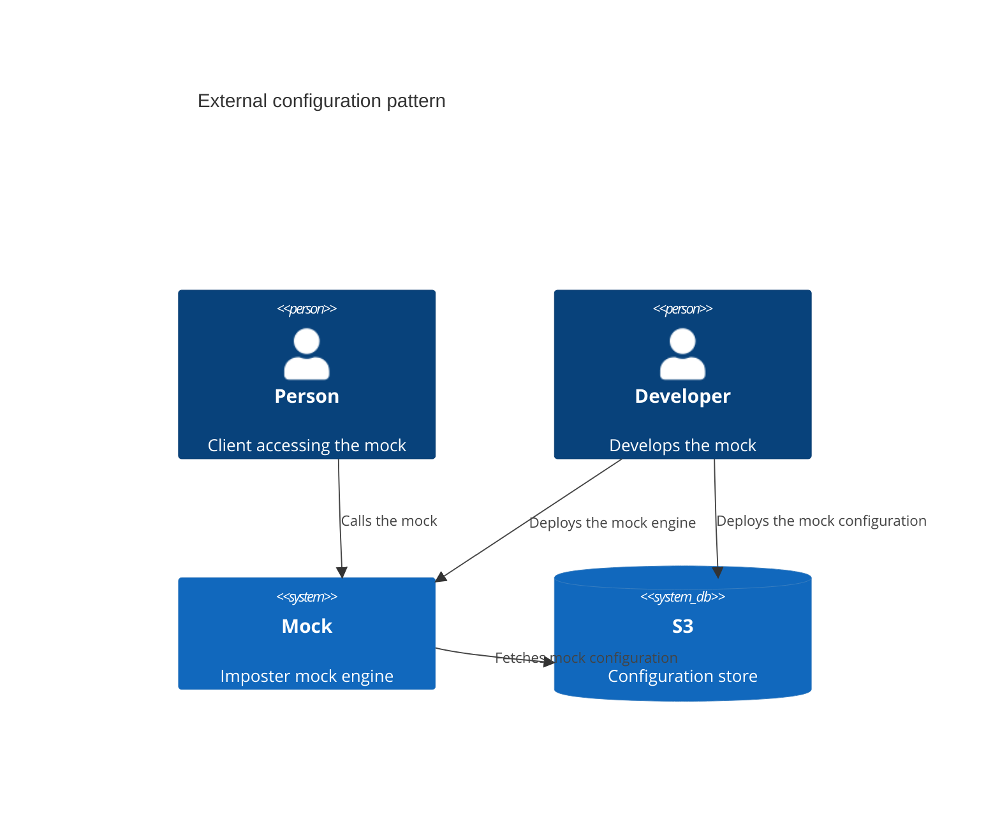
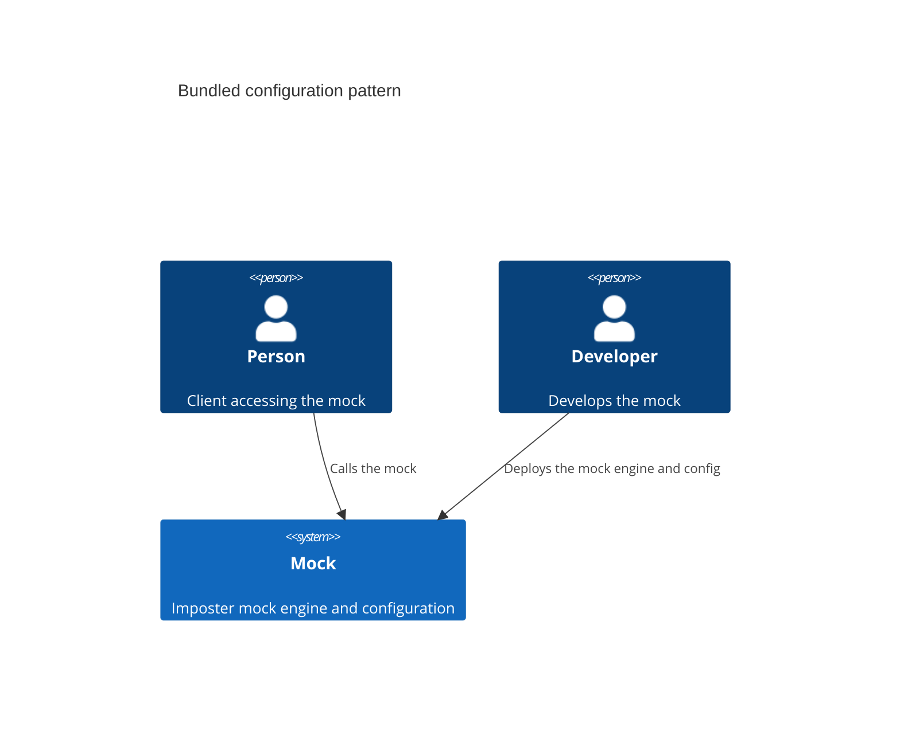

# Deployment patterns

This section describes common deployment patterns for the mock engine and configuration.

## External configuration

When deploying Imposter as a container or serverless function, a common pattern is to store configuration in an external store, such as a storage bucket.

For example, when [deploying Imposter on AWS Lambda](./run_imposter_aws_lambda.md), configuration can be held in an S3 bucket.

### Advantages

- Engine and configuration can be deployed independently
- Size of configuration deployment package is small as it does not include the mock engine as well

### Disadvantages

- Separate deployment steps required when updating mock engine and configuration
- Engine and configuration must be kept in sync by an external mechanism
- Engine must be restarted by an external mechanism to pick up new configuration

## Bundled configuration

When deploying Imposter as a container or serverless function, it is possible to bundle the configuration and engine in the same deployment unit (e.g. container image or Lambda ZIP file). This avoids the need for an external configuration store.

### Advantages

- Engine and configuration can be deployed in a single step
- Engine and configuration don't require an external mechanism to keep them in sync
- Engine does not have to be restarted by an external mechanism to pick up new configuration

### Disadvantages

- Engine is also deployed when updating configuration
- Combined deployment package is larger than deploying configuration alone

### How to bundle configuration

Bundling keeps all elements of the mock in a single package, simplifying deployment and distribution of your mocks.

See the [Bundle configuration](./bundle.md) section for instructions on how to bundle configuration for different deployment targets.
