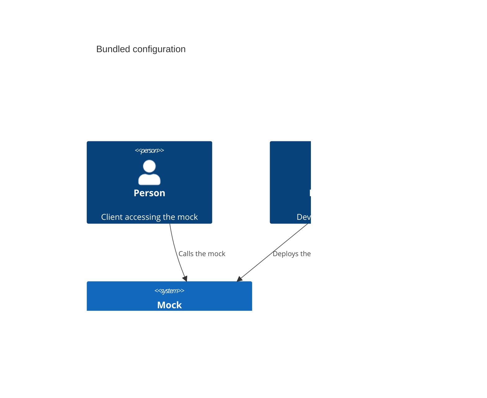

# Deployment patterns

This section describes common deployment patterns for the mock engine and configuration.

## External configuration

When deploying Imposter as a container or serverless function, a common pattern is to store configuration in an external store, such as a storage bucket.

For example, when [deploying Imposter on AWS Lambda](./run_imposter_aws_lambda.md), configuration can be held in an S3 bucket.


### Advantages

- Engine and configuration can be deployed independently
- Size of configuration deployment package is small as it does not include the mock engine as well

### Disadvantages

- Separate deployment steps required when updating mock engine and configuration
- Engine and configuration must be kept in sync by an external mechanism
- Engine must be restarted by an external mechanism to pick up new configuration

## Bundled configuration

When deploying Imposter as a container or serverless function, it is possible to bundle the configuration and engine in the same deployment unit (e.g. container image or Lambda ZIP file). This avoids the need for an external store.



### Advantages

- Engine and configuration can be deployed in a single step
- Engine and configuration don't require an external mechanism to keep them in sync
- Engine does not have to be restarted by an external mechanism to pick up new configuration

### Disadvantages

- Engine is also deployed when updating configuration
- Combined deployment package is larger than deploying configuration alone

### How to bundle configuration

Bundling is the inclusion of mock configuration alongside the Imposter binaries in a deployment package, such as a container image or Lambda ZIP file.

#### Creating a bundle for Lambda (automated)

You can create a bundle using [the CLI](./run_imposter_cli.md) using the `imposter bundle` command.

```shell
$ imposter bundle -t awslambda -o bundle.zip

creating awslambda bundle /users/person/mock using version 3.32.0
downloading https://github.com/outofcoffee/imposter/releases/download/v3.32.0/imposter-awslambda.zip
bundling 3 files from workspace
created deployment package
created awslambda bundle: /users/person/mock/bundle.zip
```

The bundle file (`bundle.zip` in this example), can be [deployed to AWS Lambda](./run_imposter_aws_lambda.md) as normal. 

#### Creating a bundle for Lambda (manual)

If you do not want to use the CLI, you can create a bundle using standard `zip` tools.

Download the latest `imposter-awslambda.zip` distribution from the [Releases page](https://github.com/outofcoffee/imposter/releases).

Let's assume your configuration sits in a directory called `config`.

```shell
$ ls -l
drwxr-xr-x  5 person  wheel  160B 16 Nov 13:12 config
-rw-r--r--  1 person  staff  20M  16 Nov 13:12 imposter-awslambda.zip
```

Add the config to the ZIP file:

```shell
$ zip -ur imposter-awslambda.zip config

  adding: config/ (stored 0%)
  adding: config/mock-config.yaml (deflated 19%)
  adding: config/response.json (stored 0%)
  adding: config/mock.txt (deflated 22%)
```

The `imposter-bundle.zip` file can be [deployed to AWS Lambda](./run_imposter_aws_lambda.md) as normal.

#### Creating a container image bundle

When [deploying using containers](./run_imposter_docker.md), you can add the configuration files into the container image itself.

Let's assume your configuration sits in a directory called `config`.

Here is an example Dockerfile:

```dockerfile
FROM outofcoffee/imposter

# your custom config
COPY config /opt/imposter/config
```

Build it:

```shell
$ docker build --tag example/mocks .
```

The container image (`example/mocks` in this example), can be [run with Docker](./run_imposter_docker.md) as normal.

```shell
$ docker run --rm -it -p 8080:8080 example/mocks
```

> See [the Docker example project](https://github.com/outofcoffee/imposter/tree/main/examples/docker) for a working example.
