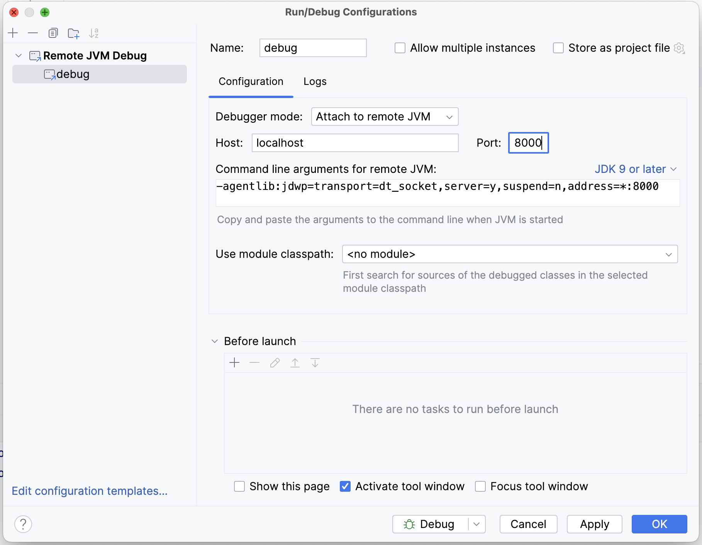

# Debugging Groovy scripts

You can attach a debugger to the JVM to step through your Groovy scripts, inspect variables etc.

The key steps involved are:

1. Enable the JVM debugger, listening on a local port
2. Start Imposter
3. Connect to the debug port

## Enable the JVM debugger

Enable the JVM debugger with the following environment variable:

    JAVA_TOOL_OPTIONS="-agentlib:jdwp=transport=dt_socket,server=y,suspend=n,address=8000"

> **Note**
> Here we have set the debug port to 8000.

### Docker users

When running in Docker, make sure to expose the debug port.

For example:

```bash
docker run --rm -it -p8080:8080 -p8000:8000 -v $PWD:/opt/imposter/config outofcoffee/imposter
```

> In this example, port 8000 is exposed along with the regular port, 8080.

## Steps for IntelliJ IDEA

These steps will explain how to connect your IDE's debugger to the debug port.

In IntelliJ, create a simple project pointing to the directory containing your script file.

In the following steps, we will add a new run configuration, start your mock and attach the debugger.

### Step-by-step

1. Add a 'Remote JVM Debug' run configuration:
   
2. Set the `Port` to the same value as the debug configuration.
3. Start Imposter and wait for the server to be ready.
4. In IntelliJ start the run configuration in Debug mode, which will connect the debugger to the Imposter JVM.

Set breakpoints in the script file as normal. When your script is invoked in Imposter, the debugger will pause on breakpoints and you can evaluate variables in scope.


