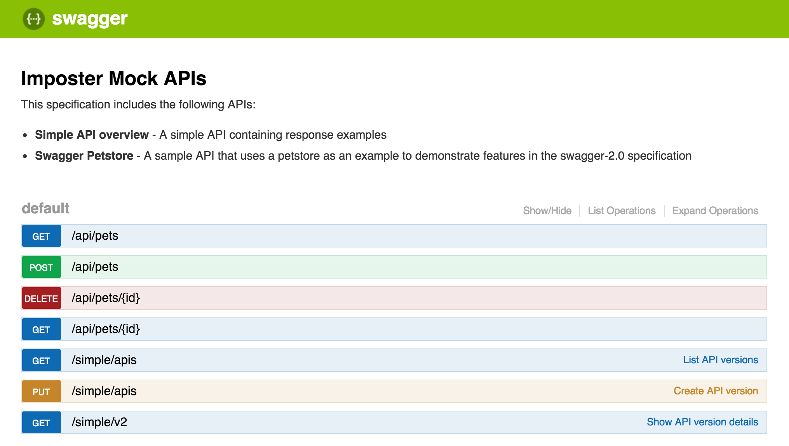

# OpenAPI (aka Swagger) plugin

* Plugin name: `openapi`
* Plugin class: `io.gatehill.imposter.plugin.openapi.OpenApiPluginImpl`

The plugin provides support for [OpenAPI](https://github.com/OAI/OpenAPI-Specification) (aka Swagger) specifications.

## Features

* Creates mock endpoints from OpenAPI/Swagger v2 and OpenAPI v3 API specifications.
* Serves response examples embedded in the specification.
* Also supports static response files and script-driven responses, using status code, response files etc.
* Provides an interactive API sandbox at `/_spec`

# Configuration

Read the [Configuration](configuration.md) section to understand how to configure Imposter.

### Additional context objects

| Object      | Type                          | Description                            |
|-------------|-------------------------------|----------------------------------------|
| `operation` | `io.swagger.models.Operation` | The OpenAPI operation for the request. |

## Using the plugin

A great way to use this plugin is to take advantage of the built in `examples` feature of OpenAPI/Swagger files. These provide a standard way to document sample responses for each API response. This plugin will match the example to serve using a combination of:

* matching URI/path
* matching content type in `Accept` HTTP request header to the `produces` property of the response
* matching status code to the response

Typically you will use a simple script (see `plugin/openapi/src/test/resources/config` for working example) to control the status code, and thus the content of the response.

You can also use the interactive API sandbox at `/_spec`; e.g. [http://localhost:8080/_spec](http://localhost:8080/_spec), which looks like this:



## Example

Here is an example configuration file:

```yaml
# petstore-config.yaml
---
plugin: openapi
specFile: petstore.yaml
```

In this example, we are using an OpenAPI specification file (`petstore.yaml`) containing the following API:

```yaml
swagger: "2.0"
info:
  version: "1.0.0"
  title: "Swagger Petstore"
consumes:
  - "application/json"
produces:
  - "application/json"
paths:
  /pets:
    get:
      description: "Returns all pets from the system"
      produces:
        - "application/json"
      responses:
        "200":
          description: "A list of pets."
          schema:
            type: "array"
            items:
              $ref: "#/definitions/Pet"
          examples:
            application/json: |-
              [
                {
                  "id": 101,
                  "name": "Cat"
                },
                {
                  "id": 102,
                  "name": "Dog"
                }
              ]
definitions:
  Pet:
    type: "object"
    required:
      - "id"
      - "name"
    properties:
      id:
        type: "integer"
        format: "int64"
      name:
        type: "string"
```

A few things to call out:

* We’ve defined the endpoint `/pets` as expecting an HTTP GET request
* We’ve said it will produce JSON responses
* One response is defined for the HTTP 200 case
* We’ve defined a basic data model in the definitions section — this is standard [JSON Schema](https://json-schema.org/)
* We’ve provided an example response — the same JSON array described earlier

### Start Imposter with the OpenAPI plugin

Let's assume your configuration is in the directory: `docs/examples/openapi/simple`.

Docker example:

    docker run --rm -ti -p 8080:8080 \
        -v $(pwd)/docs/examples/openapi/simple:/opt/imposter/config \
        outofcoffee/imposter-openapi

Standalone Java example:

    java -jar distro/rest/build/libs/imposter-openapi.jar \
        --configDir ./docs/examples/openapi/simple

This starts a mock server using the OpenAPI plugin. Responses are served based on the OpenAPI specification `petstore.yaml`.

Using the example above, you can interact with the APIs with examples in the Swagger specification at their respective endpoints under `http://localhost:8080/<endpoint path>`.

Send an HTTP request to the `/pets` path defined in the configuration file to see the example response:

    $ curl -v "http://localhost:8080/pets"
    ...
    HTTP/1.1 200 OK
    ...
    [
      {
        "id": 101,
        "name": "Cat"
      },
      {
        "id": 102,
        "name": "Dog"
      }
    ]

For specific information about the endpoints, see the interactive sandbox at [http://localhost:8080/_spec](http://localhost:8080/_spec).

Once you're finished, stop the server with CTRL+C.

> For more working examples, see:
>
> * docs/examples/openapi
> * plugin/openapi/src/test/resources/config

## Object response examples

Imposter has basic support for response examples defined as objects, for example an API specification like [object-examples.yaml](../plugin/openapi/src/test/resources/config/object-examples.yaml).

The salient part of the response is as follows:

```yaml
responses:
  "200":
    description: team response
    schema:
      type: object
      items:
        $ref: '#/definitions/Team'
    examples:
      application/json:
        id: 10
        name: Engineering
```

> Note: the JSON example is specified as an object.

Imposter currently supports JSON and YAML serialised content types in the response if they are specified in this way. If you want to return a different format, return a literal string, such as those above.

## Scripted responses (advanced)

For simple scenarios, use the `staticFile` property within the `response` object in your configuration.

For more advanced scenarios, you can also control Imposter's responses using JavaScript or Groovy scripts.

See the [Scripting](scripting.md) section for more information.
